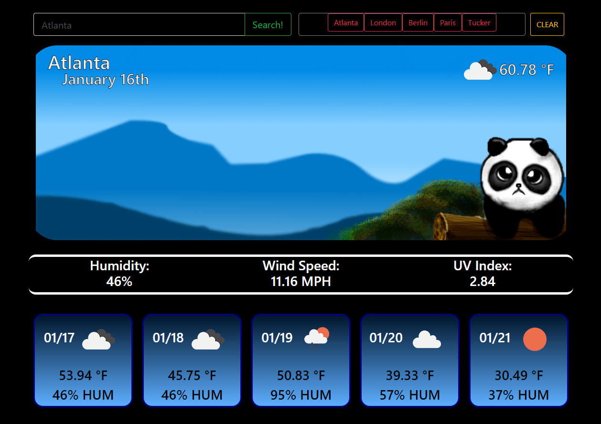

# [MatthewsWeatherDashboard](https://thematthewsawyer.github.io/MatthewsWeatherDashboard/)
### https://github.com/TheMatthewSawyer/MatthewsWeatherDashboard/
A weather dashboard that can fetch user location, stores every search locally, and has a five day forecast.

## Getting Started

This project should run in any browser. Feel free to clone or copy any part of this project.

This project can be edited in any text editor or, preferably, something like Microsoft Visual Studio Code.

## Testing

Testing can be done through an internet browser or chrome with the inspect tool (if you wish to change code on the fly).

## Built with

1. Microsoft Visual Studio Code
    1. https://code.visualstudio.com/
2. Bootstrap
    1. https://getbootstrap.com/
3. jQuery
    1. https://jquery.com/
4. Moment.js
    1. https://momentjs.com/
5. GitHub (Where you are now :grin:)
    1. https://github.com/